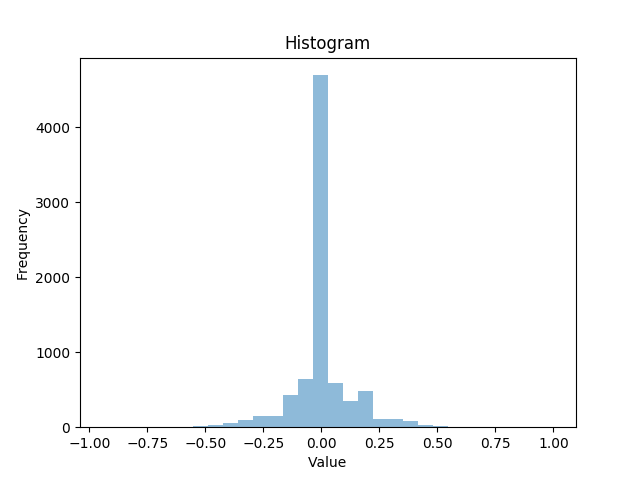

#Behavioral Cloning

#Behavrioal Cloning Project

The goals / steps of this project are the following:

    Use the simulator to collect data of good driving behavior
    Build, a convolution neural network in Keras that predicts steering angles from images
    Train and validate the model with a training and validation set
    Test that the model successfully drives around track one without leaving the road
    Summarize the results with a written report

#Files Submitted & Code Quality
1. Submission includes all required files and can be used to run the simulator in autonomous mode

My project includes the following files:

    model.py containing the script to create and train the model
    drive.py for driving the car in autonomous mode 
    model.h5 containing the weights and a model.json that includes a trained convolution neural network
    writeup_report.md or writeup_report.pdf summarizing the results

2. Submission includes functional code

Using the Udacity provided simulator and my drive.py file, the car can be driven autonomously around the track by executing

python drive.py model.h5

3. Submission code is usable and readable

The model.py file contains the code for training and saving the convolution neural network. The file shows the pipeline I used for training and validating the model, and it contains comments to explain how the code works.

#Model Architecture and Training Strategy

Here I define the first architecture. First of all I normalized the input,
Then I specify my architecture which is based on 2 inception layers and 
Max Pooling followed by another inception layer with Max Pooling and
in the end a fully connected feed forward NN 
Specifically The nomrmalize input is feeded to a
INP-A:1x1x6 and INP-B 1x1x12 CNN with RELU activation and subsample the input with 2x2 stride
INP-A:1x1x6 is feeded to a 3x3x12 CNN and a 5x5x12 CNN and a 7x7x12 CNN with RELU activation
ALL previous layers are concatenated
Max pooling for downsampling is introduced with a 3x3 kernel and 2x2 strides
Batch Normalization is added on this point
Then another inception module is added
A:1x1x24 and B 1x1x32 CNN with RELU activation
A:1x1x24 is feeded to a 3x3x32 CNN and a 5x5x12 CNN  a 7x7x32 CNN with RELU activation
ALL previous layers are concatenated
Max pooling for downsampling is introduced with a 3x3 kernel and 2x2 strides
Then another inception module is added
the last max pooled  layers feeded to a 3x3x32 CNN with RELU activation
Then the output is flatten and feeded to a feed forward layer
2 layers out of have dropout layer

The model includes RELU layers to introduce nonlinearity, and the data is normalized in the model using a Keras lambda layer.

#2. Attempts to reduce overfitting in the model

The model contains dropout layers in order to reduce overfitting.
The model was trained and validated on different data sets to ensure that the model was not overfitting. 

#3. Model parameter tuning

The model used an adam optimizer, so the learning rate was not tuned manually.

4. Appropriate training data

Training data was chosen to keep the vehicle driving on the road. 
I used a combination of center lane driving, recovering from 
the left and right sides of the road. In order to choose the 
correction angle was throught experimenting with the drive.py 
to send constant angle so as to chooses the an appropriate one 
I showed that above 0.25 was reasonably behaving better. 
Then after some training sessions I managed to find 0.3 
to be the a really good fit for the correction angle.

For details about how I created the training data, see the next section.
#Model Architecture and Training Strategy
1. Solution Design Approach

The overall strategy for deriving a model architecture was to build up inception models. 
Let Adam optimizer fix the parameters.

My first step was to use a convolution neural network model similar to the inception model. 
I thought this model might be appropriate because of the very good image classification abilities.

The final step was to run the simulator to see how well the car was driving around track one. There were a few spots where the vehicle fell off the track near the bridge to improve the driving behavior I tried NVIDIA's architecture.

2. Final Model Architecture

Here I define my final architecture. First of all I normalize the input,
Then a 3x3x12 CNN with batch normalization and ELU activation is introduced
Then another  3x3x32 CNN with batch normalization and ELU activation
Then Max pooling for downsampling is introduced with a 3x3 kernel and 2x2 strides
Then another  3x3x64 CNN with batch normalization and ELU activation
Then Max pooling for downsampling is introduced with a 3x3 kernel and 2x2 strides
Following is a dropout layer 0.2
Then the output is flatten and feeded to a feed forward layer
with two hidden layers, with 300 and 60 neurons
1 layer has dropout 0.2
One last neuron for steering
The steering angle single neuron exists  in the end.

Here is the output of the python script
Epoch 1/3
38640/38568 [==============================] - 1064s - loss: 2.8991 - val_loss: 0.0435
Epoch 2/3
38676/38568 [==============================] - 1063s - loss: 0.0431 - val_loss: 0.0322
Epoch 3/3
38640/38568 [==============================] - 1062s - loss: 0.0384 - val_loss: 0.0329

3. Creation of the Training Set & Training Process
I performed some statistic analysis with the stats.py script and found the following histogram
of the angles. As we can see the dataset is prety biased towards right turns.

I read about using the left and right image and after messing around with the drive.py
I found 0.25 is a good value for steering left and right.

Furthermore, there are more positive (1900 counts) than negative angle values (1775 counts). 
Last but not least there are 4361 zero angle values.

I used the data set provided by the course and split training/validation sets with 0.2 portion and shuffled them.
Initially, my generator doubled the data on one positions it performed one of the following
a)Flip the center image
b)Flip and blur center image
c)The original center image
d)The blurred  center image
e)The adjusted gamma  center image
In the other position it included one of the following
a) Left image
b) Right  image
c) Flipped left image
d) The adjusted gamma  right image 
e) The blurred  right image

Rethinking the fact that the simulator is not going to have any problems with blurring of the camera input
I decided that I only need the left/right image and the flipped ones for better driving behavior.
Moreover, at this point I changed my architecture to look like nvidia's. 
Then I played a little bit with the architecture to make it smaller.

Then after this the model still kept failing after the bridge. New architecture might be a solution.
